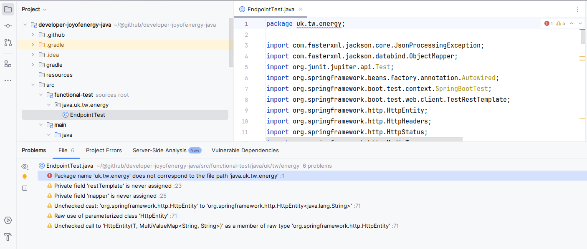

## Logs

After open the project folder with Intelij, there is compiling error on the following.  

## Jenkins
http://localhost:8888/job/dev_developer-joyofenergy-java/

## Docker
./gradlew jar
docker-compose up --build api

## Guildlines
1. Clear Roles: Designate driver and navigator.
2. Effective Communication: Discuss, explain, and ask questions.
3. Set Goals: Define session objectives.
4. Encourage Feedback: Be constructive and specific.
5. Active Listening: Listen without interrupting.
6. Role Rotation: Switch frequently.
7. Collaboration Tools: Use shared coding environments.
8. Focus on Learning: Be open to different approaches.
9. Review and Reflect: Learn from the experience.
10. Patience and Empathy: Be understanding and supportive.